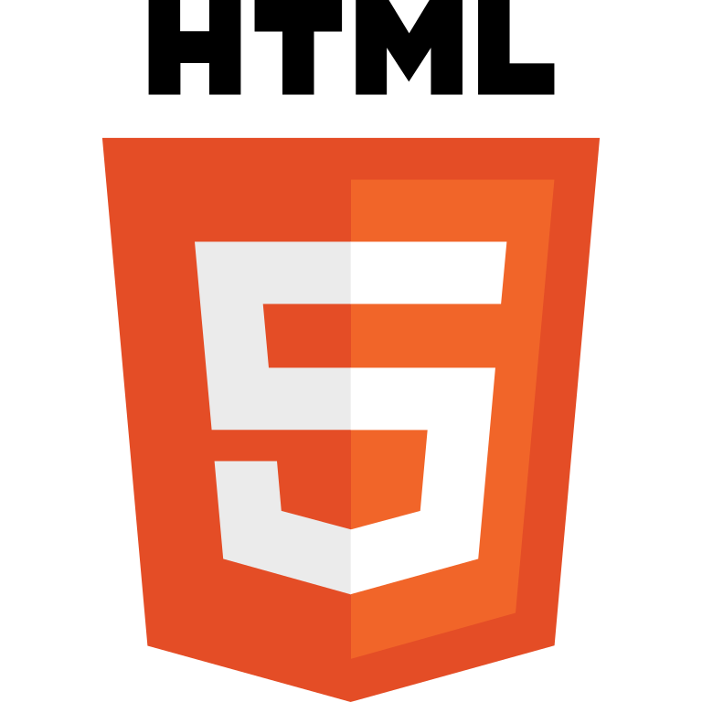
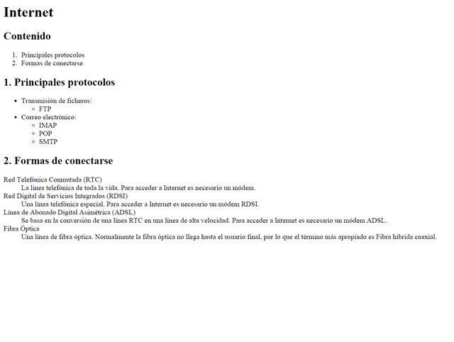

# Introducción HTML



HTML (Lenguaje de Marcas de Hipertexto) es el componente (lenguaje) más básico de la Web. 
"Hipertexto" hace referencia a los enlaces que conectan páginas web entre sí, ya sea dentro de un único sitio web o entre sitios web.

HTML utiliza "marcas" para etiquetar texto, imágenes y otro contenido para mostrarlo en un navegador Web. Las  marcas HTML incluyen "elementos" especiales como:

    <head>, <title>, <body>, <header>, <footer>, <article>, <section>, <p>, <div>, <span>, , <aside>, <audio>, <canvas>, <datalist>, <details>, <embed>, <nav>, <output>, <progress>, <video>, <ul>, <ol>, <li> 
    
y muchos otros.

Un elemento HTML se distingue de otro texto en un documento mediante "etiquetas", que consisten en el nombre del elemento rodeado por "<" y ">" (corchetes angulares). 

NOTA: El nombre de un elemento dentro de una etiqueta no distingue entre mayúsculas y minúsculas. Es decir, se puede escribir en mayúsculas, minúsculas o una mezcla. Por ejemplo, la etiqueta <title> se puede escribir como <Title>, <TITLE> o de cualquier otra forma, aunque **actualmente trabajamos en minúsculas**.

## Estructura básica de un HTML

Veamos la estructura básica de un documento html 5: 

```html
    <!DOCTYPE html>
    <html lang="es">
        <head>
            <meta charset="UTF-8">
            <title>Document</title>
        </head>
        <body>
        </body>
    </html>

```

Analicemos este código: 

1. **!DOCTYPE html** -> Indica al navegador que estamos ante un documento HTML5 y le indica al navegador cómo interpretarlo.

[MÁS_INFORMACIÓN_DOCTYPE](https://devcode.la/tutoriales/doctype-que-es-y-para-que-sirve/)

2. **html** -> Raíz del documento (todos los documentos HTML se almacenan en la memoria del navegador como un árbol, de ahí el nombre de raíz). 

3. **head** -> Etiqueta que almacena la información menos visible de la página, pero que permite configurarla de manera correcta. La información que nos permite añadir en ella es, entre otra, configuración de caracteres, idioma (como se puede ver en el atribuyto lang), título (aparece en la pestaña del navegador), favicon (imagen de la pestaña)...etc

4. **meta charset="UTF-8"** -> Configuración de caracteres. La etiqueta meta permite configurar metadatos en nuestro HTML.
NOTA: UTF-8 es un formato de codificación de caracteres (formato para almacenar los caracteres).

[MÁS_INFORMACIÓN_META](https://www.ionos.es/digitalguide/paginas-web/desarrollo-web/los-meta-tags-mas-importantes-y-su-funcion/)

5. **title** -> Título de nuestra página. No se refiere a una sección, ni a una parte del documento, sino a la página a nivel general.

6. **body** -> Cuerpo de la página, lo que vamos a ver en nuestra web, va en esta sección.

## Primer ejemplo: Hola Mundo.

Ahora vamos a hacer nuestro **Hola Mundo** en HTML, pero antes hablemos de esto: 
```html

    <!DOCTYPE html>
    <html lang="es">
    <head>
        <meta charset="UTF-8">
        <title>Primer documento HTML5</title>
    </head>
    <body>
        Hola Mundo
    </body>
    </html>

```
# Etiquetas
Como se ha comentado en la introducción las etiquetas se denotan entre corchetes angulares (<>).
En HTML5 disponemos de un listado de 142 etiquetas actualmente.

Las etiquetas nos permiten marcar información que puede ser, entre otros: 

- Texto
- Enlaces
- Vídeos
- Audios 

**Ejemplos:**

```html

    <p>Esta etiqueta almacena texto</p>
    <a href="http://www.google.es">Esta etiqueta tiene un enlace</a>
    
    <!--Etiqueta para vídeo-->
    <video width="320" height="240" controls>
        <source src="movie.mp4" type="video/mp4">
        Tu navegador no soporta vídeo.
    </video>

```

## Atributos
Los atributos se incluyen en las etiquetas y permiten configurar diferentes parámetros que amplían la funcionalidad de las etiquetas.

Por ejemplo en las etiquetas a y video ya hemos visto atributos, analicemos el formato:

```html 

    nombre_atributo = "valor/es" <!--Siempre dentro de una etiqueta y entre comillas el valor-->

```
Los nombres válidos para los atributos de las etiquetas también están predefinidos dentro del lenguaje.

Comentemos un ejemplo básico: 

```html

    <a href="http://www.google.es">Esta etiqueta tiene un enlace</a>    

```
href="url" -> Este es el atributo principal que permite la etiqueta <a> 


## Comentarios
En HTML se usan los siguientes caracteres: 
- Inicio: "<!--"
- Fin: "-->"

**Ejemplo:**

```html

    <!--Comentario de ejemplo en HTML5-->

```

## Párrafos
Una de las cuestiones más básicas que podemos definir a nivel de texto, es un párrafo, la etiqueta que nos permite realizar esta tarea es "p", veamos un ejemplo: 

```html
    
    <p>Esto es un párrafo de texto en HTML5</p>

```

[MÁS_INFORMACIÓN_P](https://developer.mozilla.org/es/docs/Web/HTML/Element/p)


## Cabeceras
Se usan para títulos, las etiquetas son las "h", que van desde h1 (título de mayor tamaño e importancia) hasta h6 (título de menor tamaño e importancia). Hay una jerarquía.

```html
    
    <h1>Esto título con h1 en HTML5</h1>
    <h2>Esto título con h2 en HTML5</h2>
    <h3>Esto título con h3 en HTML5</h3>
    <h4>Esto título con h4 en HTML5</h4>
    <h5>Esto título con h5 en HTML5</h5>
    <h6>Esto título con h6 en HTML5</h6>

```

[MÁS_INFORMACIÓN_H](https://developer.mozilla.org/es/docs/Web/HTML/Element/Heading_Elements)

### Formato texto

Veamos algunas de las etiquetas que nos ayudan a dar formato al texto: 

    - <b> - Negrita (Bold Text)
    - <strong> - Resaltado (Important text)
    - <i> - Texto alternativo, por ejemplo términos técnicos (Italic text)
    - <em> - Cursiva (Emphasized text)
    - <mark> - Texto marcado o resaltado como referencia o anotación, debido a su relevancia o importancia en un contexto particular (Marked text)
    - <small> - Comentarios en letra pequeña, por ejemplo derechos de ator (Smaller text)
    - <sub> - Subíndice (Subscript text)
    - <sup> - Superíndice (Superscript text)
    - <pre> - Texto con formato (Preformatted text)
    - <span> - Texto que queremos identificar para aplicar estilos por ejemplo. 

[MÁS INFORMACIÓN FORMATO](https://www.w3schools.com/html/html_formatting.asp)

[CITAS](https://www.w3schools.com/html/html_quotation_elements.asp)

## Divisiones
La etiqueta **div** se usa para dividir nuestra página, con la web semántica ha quedado relativamente en desuso, pero aún se conserva y nos va a ayudar en la parte de CSS, para poder aplicar estilos a una parte de nuestro código.

**Ejemplo:**

    <div id="division1">
        <p>Párrafo1</p>
        <p>Párrafo2</p>
    </div>

[MÁS INFORMACIÓN_DIV](https://developer.mozilla.org/es/docs/Web/HTML/Element/div)

## Listas
Se utilizan para organizar información de forma jerarquica.

En HTML disponemos de 3 tipos de listas: 
1. Con orden
2. Sin orden 
3. De definición

### Ordenadas
Las etiquetas que se usan en este caso son **ol** y **li**.

Podemos ordenar según diversos criterios: 
1. 1 - Listas decimales -> Tipo por defecto
2. a - Listas alfabéticas en minúsculas
3. A - Listas alfabéticas en mayúsculas
4. i - Listas de números romanos en minúsculas
5. I - Listas de números romanos en mayúsculas

**Ejemplos:**

    <ol type=”A”>
        <li>Julio</li>
        <li>Carmen</li>
        <li>Ignacio</li>
        <li>Elena</li>
    </ol>

    <!-- O bien-->
    <ol reversed>
        <li>Julio</li>
        <li>Carmen</li>
        <li>Ignacio</li>
        <li>Elena</li>
    </ol>


### Desordenadas
Las etiquetas que se usan en este caso son **ul** y **li**.

**Ejemplos:**

    <ul>
        <li>FC. Barcelona</li>
        <li>Real Madrid</li>
        <li>Real Betis</li>
        <li>Atlético de Madrid</li>
    </ul>

### De definición 
Las etiquetas que se usan en este caso son **dl**, **dt y **dd**.

1. dl -> Lista
2. dt -> Término a definir
3. dd -> Definición

**Ejemplo:**

    <dl>
        <dt>Casa</dt>
        <dd>Edificio para habitar. Una casa de ocho plantas.</dd>
        <dt>Programación</dt>
        <dd>Acción y efecto de programar.</dd>
        <dt>Programar</dt>
        <dd>Elaborar programas para su empleo en computadoras.</dd>
    </dl>


[MÁS_INFORMACIÓN_LISTAS](https://www.w3schools.com/html/html_lists.asp)

## Tablas 
Las tablas pueden ser muy útiles para ordenar información dentro de nuestra aplicación.

Las etiquetas básicas son:**table**, **th**, **tr** y **td**:
1. table -> Indica que comienza el bloque que compone una tabla
2. th -> Títilos de la cabecera de la tabla
3. tr -> Filas
4. td -> Columnas (datos en sí)

**Ejemplo:**

    <table class="default">
    <tr>
        <th>Título 1</th>
        <th>Título 2</th>
        <th>Título 3</th>
    </tr>  
    <tr>
        <td>Celda 1</td>
        <td>Celda 2</td>
        <td>Celda 3</td>
    </tr>
    <tr>
        <td>Celda 4</td>
        <td>Celda 5</td>
        <td>Celda 6</td>
    </tr>
    </table>


[MÁS_INFORMACIÓN_TABLAS](https://www.htmlquick.com/es/tutorials/tables.html)

## Formularios

Los formularios son  una parte muy importante de nuestras páginas elaboradas con HTML.

Las etiquetas que vamos a usar son: **form**, **label** e **input** (aunque hay más). Veamos una pequeña explicación de las mismas y un ejeplo de un formulario básico: 

1. form -> Etiqueta principal (raíz) del formulario, lo representa y dentro de ella vamos a elaborar nuestro formulario completo.

Dispone además de dos atributos muy importantes (entre otros), para darle funcionalidades importantes: 

- action -> Indica el script al que queremos asociar el formulario, para que en el lado del servidor se puedan procesar los datos del mismo. De momento no lo vamos a usar.

- method -> Indica el método de envío de información que vamos a usar para hacer llegar los datos al servidor.

2. label -> Usada para etiquetar las partes del formulario 

3. input -> Usada para crear controles o métodos de recogida de información dentro de un formulario,

**Ejemplo:**

```
    <form action="guardar()" method="GET">
        <label>Nombre:</label>
        <input type="text" name="name">
        <input type="submit" value="Guardar">
    </form>

```
[MÁS_INFORMACIÓN_FORM](https://developer.mozilla.org/es/docs/Web/HTML/Element/form)
[MÁS_INFORMACIÓN_INPUT](https://developer.mozilla.org/es/docs/Web/HTML/Element/input)

## Ejercicio
1. Realiza un ejemplo con cada una de las etiquetas de formato, para que puedas ver el aspecto del texto y te vayas familiarizando con ellas.

2.  Crea un documento HTML5, con el siguiente texto y formato:

    **TEMA 1: Introducción y HTML5** 
    
    En este primer tema vamos a ver, además de la introducción, todas las características de HTML5.
    
    **TEMA 2: CSS**
    
    En el tema 2 veremos lo más importante de CSS 
    
    **TEMA 3: Javascript Básico**
    
    En el tema 3 indagaremos en los fundamentos de Javascript y de la programación estrucurada.

[SOLUCIÓN EJERCICIO 2](./soluciones_ejercicios_html/ejer2.html)

3. A partir del siguiente código: 

```
    <!DOCTYPE html>
    <html>
        <head>
        <title>El título de la página</title>
        </head>
    <body>
        <p><strong>HTML</strong> son las siglas de <em>HyperText Markup Language</em>, que puede traducirse como lenguaje de marcas o marcado de hipertexto.
        </p>
        <p>El lenguaje HTML se emplea para crear las páginas web. Es muy fácil ver el código HTML de una página web, la opción exacta cambia de un navegador a otro y también puede cambiar de una versión a otra de un mismo navegador, pero suelen tener un nombre similar.
        </p>
        <p>HTML se compone de etiquetas que se escriben entre los símbolos menor que y mayor que.</p>
        <p>Los inicios del lenguaje HTML se remontan al año 1990, cuando Tim Berners-Lee creó la primera página web.</p>
        </body>
    </html>

```

Realiza las siguientes modificaciones: 

- Las siglas HTML deben aparecer como texto destacado (texto importante)en toda la página.
- Tim Berners-Lee debe aparecer como texto enfatizado (cursiva) en toda la página.
- Debes añadir el siguiente contenido:
    - Un encabezado de nivel 1 con el texto "HTML" antes de "HTML son las siglas de..."
    - Un encabezado de nivel 2 con el texto "Historia de HTML" antes de "Los inicios del lenguaje HTML..."
    - Un encabezado de nivel 2 con el texto "Versiones de HTML" antes de dos nuevos párrafos que contienen el texto "Tim Berners-Lee definió la primera versión de HTML en el año 1991" y "En la actualidad, la última versión de HTML es HTML5".

Aspecto del resultado final: 


4. Usando listas, crea una página, cuyo resultado final sea el siguiente: 


5. Corrige los errores del siguiente HTML:
```html
    <DOCTYPE html>
    <html>
        <head>
            </meta charset="utf-8">
            <meta name="description" content="Ejercicio HTML - Corrige los errores">
        <body>
        </head>
            <title>Corrige los errores que encuenres en el documento</title>
            
        <h1>Aprender HTML es muy divertido</h1>
        
        <p>Lorem ipsum dolor sit amet, consectetur adipisicing elit. Molestiae quam optio nesciunt atque iure  animi dicta velit
    
        <p>Lorem ipsum dolor sit amet, consectetur adipisicing elit. Molestiae quam optio nesciunt atque iure  animi dicta velit</p>
        
    
        </body>
        <p>Lorem ipsum dolor sit amet, consectetur adipisicing elit. Molestiae quam optio nesciunt atque iure  animi dicta velit</p>
    <html>
```

6. Teniendo el siguiente texto sin formato, añádele etiquetas de cabecera y de párrafos. 

```
    Título principal que resume la idea general del escrito
    30 palabras de párrafo de bienvenida con texto lorem ipsum
    Primera idea principal a desarrollar en el escrito.
    30 palabras de párrafo que desarrolla la primera idea principal y que tiene varios subtemas a desarrollar a continuación.
    Primer subtema a desarrollar de la primera idea principal.
    30 palabras de párrafo que desarrolla el primer subtema de la primera idea principal.
    Segundo subtema a desarrollar de la primera idea principal.
    30 palabras de párrafo que desarrolla el segundo subtema de la primera idea principal.
    Segunda idea principal a desarrollar en el escrito.
    30 palabras de párrafo que desarrolla la segunda idea principal y que tiene varios subtemas a desarrollar a continuación.
    Primer subtema a desarrollar de la segunda idea principal.
    30 palabras de párrafo que desarrolla el primer subtema de la segunda idea principal.
    Segundo subtema a desarrollar de la primera idea principal.
    30 palabras de párrafo que desarrolla el segundo subtema de la segunda idea principal.
    Conclusiones 
    Párrafo de 30 palabras con la síntesis de las ideas desarrolladas.
    Párrafo de 20 palabras de despedida.
```
