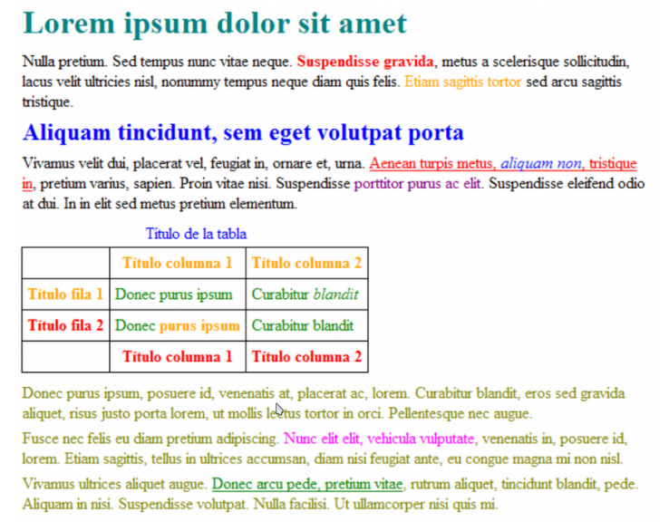

# Selectores Avanzados
Utilizando solamente los selectores básicos de la sección anterior, es posible diseñar prácticamente cualquier página web. No obstante, CSS define otros selectores más avanzados que permiten simplificar las hojas de estilos.

### Descendente
Selecciona los elementos que se encuentran dentro de otros elementos. Un elemento es
descendiente de otro cuando se encuentra entre las etiquetas de apertura y de cierre del otro
elemento.

El selector del siguiente ejemplo selecciona todos los elementos **span** de la página que se
encuentren dentro de un elemento **p**:

```

    p span { 
        color: red; 
    }

```

Ejemplo: 

```

    <!DOCTYPE html> 
    <html lang="es"> 
        <head> <meta charset="UTF-8" /> 
            <title>Ejemplo de estilos selector descendente</title> 
            <style type="text/css"> 
                p span { color: red; } 
            </style> 
            </head> 
            <body> 
                <section> 
                    <p> Aquí tenemos parte del texto <span>en rojo</span>. 
                        <br /> 
                        Incluso en un nivel inferior, como un 
                        <a href="#"><span>enlace</span></a> 
                    </p> 
                    <br> 
                    Fuera del párrafo el <span> SPAN se mantiene negro</span> 
                </section> 
        </body> 
    </html>

```

Los selectores descendentes permiten aumentar la precisión del selector de tipo o etiqueta. Así,
utilizando el selector descendente es posible aplicar diferentes estilos a los elementos del mismo
tipo. El siguiente ejemplo amplía el anterior y muestra de color azul todo el texto de los **span**
contenidos dentro de un **h1**

Otro ejemplo: 

```

    <!DOCTYPE html> 
    <html lang="es"> 
        <head> <meta charset="UTF-8" /> 
            <title>Ejemplo de estilos seelctor descendente</title> 
            <style type="text/css"> 
                p span { color: red; }
                h1 span { color: blue; } 
            </style> 
        </head> 
    <body> 
        <section> 
            <h1> <span>Titulo en Azul</span></h1>
            <p> Aquí tenemos parte del texto <span>en rojo</span>. 
        </section> 
    </body> 
    </html>

```

Con las reglas CSS anteriores:

- Los elementos **span** dentro de un elemento **p** se muestran de color rojo.
- Los elementos **span** dentro de un elemento **h1** se muestran de color azul.
- El resto de elementos **span** de la página, se muestran con el color por defecto aplicado por el navegador.

[MÁS_RECURSOS](https://www.w3schools.com/css/)

## De hijos 
Se trata de un selector similar al selector descendente, pero muy diferente en su funcionamiento.
Se utiliza para seleccionar un elemento que es hijo directo de otro elemento y se indica mediante
el "signo de mayor que o corchete angular de cierre" (>):

```
    p > span { color: blue; }
    <p><span>Texto1</span></p>
    <p><a href="#"><span>Texto2</span></a></p>

```

En el ejemplo anterior, el selector p > span se interpreta como "cualquier elemento **span** que sea hijo directo de un elemento **p**", por lo que el primer elemento **span** cumple la condición del  selector. Sin embargo, el segundo elemento **span** no la cumple porque es descendiente pero no es hijo directo de un elemento **p**.

El siguiente ejemplo muestra las diferencias entre el selector descendente y el selector de hijos:

```

    <!DOCTYPE html> 
    <html lang="es"> 
        <head> <meta charset="UTF-8" /> 
        <title>Ejemplo de estilos selector descendente y el selector de hijos</title> 
        <style type="text/css"> 
            p a { color: red; }
            p > a { color: blue; }
        </style> 
    </head> 
    <body> 
        <section> 
            <p><a href="#">Enlace1</a></p>
            <p><span><a href="#">Enlace2</a></span></p>
        </section> 
    </body> 
    </html>

```
Obsérvese como en el primer caso, al ser un selector descendente, se aplica al segundo enlace (aunque esté span por medio), mientras que **p > a** nos indica un enlace hijo directo de p, que es el primer caso.

## Adyacente
El selector adyacente se emplea para seleccionar elementos que en el código HTML de la página
se encuentran justo a continuación de otros elementos. Su sintaxis emplea el signo + para separar
los dos elementos:

```
    elemento1 + elemento2 { ... }

```

Si se considera el siguiente código HTML:

```

    <body>
    <h1>Titulo1</h1>
    <h2>Subtítulo</h2>
    ...
    <h2>Otro subtítulo</h2>
    ...
    </body>

```

La página anterior dispone de dos elementos **h2**, pero sólo uno de ellos se encuentra nmediatamente después del elemento **h1**. Si se quiere aplicar diferentes colores en función de esta circunstancia, el selector adyacente es el más adecuado:

```
    h2 { color: green; }
    h1 + h2 { color: red }

```

Las reglas CSS anteriores hacen que todos los **h2** de la página se vean de color verde, salvo
aquellos **h2** que se encuentran inmediatamente después de cualquier elemento **h1** y que se
muestran de color rojo.

Técnicamente, los elementos que forman el selector adyacente deben cumplir las dos siguientes
condiciones:

- elemento1 y elemento2 deben ser elementos hermanos, por lo que su elemento padre debe ser el mismo.
- elemento2 debe aparecer inmediatamente después de elemento1 en el código HTML de la página.

El siguiente ejemplo es muy útil para los textos que se muestran como libros:

```

    p + p { text-indent: 1.5em; }

```

En muchos libros, suele ser habitual que la primera línea de todos los párrafos esté indentada, salvo la primera línea del primer párrafo. Con el selector p + p, se seleccionan todos los párrafos de la página que estén precedidos por otro párrafo, por lo que no se aplica al primer párrafo de la página.

Veamos un ejemplo: 

```
    <!DOCTYPE html> 
    <html lang="es"> 
        <head> <meta charset="UTF-8" /> 
            <title>Ejemplo de estilos selector </title> 
            <style type="text/css"> 
                h2 { color: green; }
                h1 + h2 { color: red }
            </style> 
        </head> 
    <body> 
        <section> 
            <h1>Titulo Principal</h1>
            <h2>Subtítulo1</h2>
            <p></p><br /><p></p><br />
            <h2>Subtítulo2</h2>
        </section> 
    </body> 
    </html>

```
## De atributos
El último tipo de selectores avanzados lo forman los selectores de atributos, que permiten seleccionar elementos HTML en función de sus atributos y/o valores de esos atributos.

Los cuatro tipos de selectores de atributos son:

- [nombre_atributo], selecciona los elementos que tienen establecido el atributo llamado nombre_atributo, independientemente de su valor.
- [nombre_atributo=valor], selecciona los elementos que tienen establecido un atributo llamado nombre_atributo con un valor igual a valor.
- [nombre_atributo~=valor], selecciona los elementos que tienen establecido un atributo llamado nombre_atributo y al menos uno de los valores del atributo es valor.
- [nombre_atributo|=valor], selecciona los elementos que tienen establecido un atributo llamado nombre_atributo y cuyo valor es una serie de palabras separadas con guiones,pero que comienza con valor. Este tipo de selector sólo es útil para los atributos de tipo lang que indican el idioma del contenido del elemento.

A continuación se muestran algunos ejemplos de estos tipos de selectores:
```
    <!DOCTYPE html> 
    <html lang="es"> 
        <head> <meta charset="UTF-8" /> 
            <title>Ejemplo de estilos selectores de atributos </title> 
            <style type="text/css"> 
                /* Se muestran de color verde todos los enlaces que tengan 
                un atributo "id", independientemente de su valor */ 
                a[id] { color: green; } 
                /* Se muestran de color amarillo todos los enlaces que tengan 
                un atributo "class" con el valor "externo" */ 
                a[class="externo"] { color: yellow; } 
                /* Se muestran de color violeta todos los enlaces que apunten 
                al sitio "http://www.ejemplo.com" */ 
                a[href="http://www.ejemplo.com"] { color: purple ; } 
                /* Se muestran de color naranja todos los enlaces que tengan un atributo "class" 
                en el que al menos uno de sus valores sea "externo" */ 
                a[class~="abajo"] { color: orange; } 
                /* Selecciona todos los elementos de la página cuyo atributo 
                "lang" sea igual a "en", es decir, todos los elementos en inglés */ 
                *[lang=en] { color: brown; } 
                /* Selecciona todos los elementos de la página cuyo atributo 
                "lang" empiece por "es", es decir, "es", "es-ES", "es-AR", etc. */ 
                *[lang|="es"] { color : red } 
            </style> 
        </head> 
    <body> 
        <section> 
            <a id="interno" href="#">Enlace Interno</a> <br /> 
            <a class="externo" href="#">Enlace Externo</a> <br /> 
            <a class="arriba abajo" href="#">Enlace Arriba/Abajo</a> <br /> 
            <a href="http://www.ejemplo.com">Enlace Ejemplo</a> <br /> 
            <a lang="en" href="#">Enlace Inglés</a> <br /> 
            <a lang="es-ar" href="#">Enlace Español</a> <br /> 
        </section> 
    </body> 
    </html>

```
## Herencia

Una de las características principales de CSS es la herencia de los estilos definidos para los elementos. Cuando se establece el valor de una propiedad CSS en un elemento, sus elementos descendientes heredan de forma automática el valor de esa propiedad. Si se consideramos el siguiente ejemplo: 

```
    <!DOCTYPE html> <html lang="es"> 
    <head> 
        <meta charset="UTF-8" /> 
        <title>Ejemplo de estilos herencia</title> 
        <style type="text/css"> 
            body { color: blue; }
        </style> 
    </head> 
    <body> 
        <section> 
            <h1>Titulo Principal</h1>
            <p>Un párrafo de texto no muy largo.</p>
        </section> 
    </body> 
    </html>
```

En el ejemplo anterior, el selector body solamente establece el color de la letra para el elemento **body**. No obstante, la propiedad color es una de las que se heredan de forma automática, por lo que todos los elementos descendientes de **body** muestran ese mismo color de letra. Por tanto, establecer el color de la letra en el elemento **body** de la página implica cambiar el color de letra de todos los elementos de la página

Algunos ejemplos de propiedades que se heredan en CSS son:

#### Color del Texto (color):
```
body {
  color: blue;
}
```
Todos los elementos de texto dentro del cuerpo heredarán el color azul a menos que se anule específicamente.

#### Fuente (font):
```
body {
  font-family: Arial, sans-serif;
}
```
Todos los elementos hijos de <body> heredarán la fuente especificada a menos que se sobrescriba.

#### Tamaño del Texto (font-size):
```
h1 {
  font-size: 24px;
}
```
Todos los elementos h1 heredarán este tamaño de fuente, a menos que se anule explícitamente.

### Estilo de Texto (font-style), Peso de la Fuente (font-weight), etc.:
```
em {
  font-style: italic;
  font-weight: bold;
}
```
Los elementos em y sus descendientes heredarán estas propiedades de estilo.

Sin embargo, no todas las propiedades se heredan. Algunas propiedades, como las relacionadas con el diseño o la posición, generalmente no se heredan. Por ejemplo, width, height, margin, padding, entre otros, no se heredan.

Aunque la herencia de estilos se aplica automáticamente, se puede anular su efecto estableciendo de forma explícita otro valor para la propiedad que se hereda, como se muestra en el siguiente:
```
    <!DOCTYPE html> 
    <html lang="es"> 
        <head> 
            <meta charset="UTF-8" /> <title>Herencia</title> 
            <style> 
                body {color: blue; font-family: Arial;} 
                p { font-family: cursive;} /* Los párrafos los pongo en Comic Sans*/ 
                span {color: red;} 
            </style>
        </head> 
        <body> 
            <section> 
            <h1>Titulo de Sección</h1> 
            <p> Esto es un párrafo con <span> TEXTO ESPECIAL</span></p> 
            </section> 
        </body> 
    </html>
```

En el ejemplo anterior, se establece en primer lugar el color y tipo de letra del elemento **body**,
por lo que todos los elementos de la página se mostrarían con ese mismo color y tipo de letra. No obstante, las otras reglas CSS modifican alguno de los estilos heredados. De esta forma, los elementos **h1** de la página se muestran con el tipo de letra Verdana establecido por el selector **h1** y se muestran de color negro que es el valor heredado del elemento **body**. Igualmente, los elementos **p** de la página se muestran del color rojo establecido por el selector p y con un tipo de letra Arial heredado del elemento **body**.

La mayoría de propiedades CSS aplican la herencia de estilos de forma automática. Además, para aquellas propiedades que no se heredan automáticamente, CSS incluye un mecanismo para forzar a que se hereden sus valores, tal y como se verá más adelante. Por último, aunque la herencia automática de estilos puede parecer complicada, simplifica en gran medida la creación de hojas de estilos complejas. Como se ha visto en los ejemplos anteriores, si se quiere establecer por ejemplo la tipografía base de la página, simplemente se debe establecer en el elemento **body** de la página y el resto de elementos la heredarán de forma automática.

## Colisiones y conflictos

## 1. Conflicto de Selectores:
Si tienes reglas de estilo que afectan al mismo elemento utilizando diferentes selectores, es posible que se produzca un conflicto. CSS seguirá las reglas de especificidad y cascada para determinar cuál prevalece. Utiliza selectores más específicos o ajusta el orden de tus reglas CSS para resolver este problema.

Las reglas de especificidad y la cascada son principios fundamentales en CSS que determinan cómo se aplican y priorizan los estilos cuando hay múltiples reglas que afectan a un elemento. Aquí hay un resumen de estas reglas:

#### Especificidad:
La especificidad se refiere a qué tan específico es un selector. Se mide en cuatro partes:

Elementos y pseudoelementos: 0
Clases, atributos y pseudoclases: 1
ID: 100
Estilo en línea: 1000

La especificidad se representa como una serie de cuatro números. Por ejemplo, una regla con un selector como div p#id1.class1 tendría una especificidad de 0-1-1-1 (porque hay un elemento, una clase, un ID y un estilo en línea).
Cuando dos reglas entran en conflicto, la regla con la mayor especificidad prevalece.

#### Cascada:
La cascada se refiere al proceso de aplicación de estilos cuando hay múltiples reglas que afectan al mismo elemento. Si dos reglas tienen la misma especificidad, la regla que aparece más tarde en el código prevalece. Si ambas reglas tienen la propiedad !important, la regla con la mayor especificidad aún prevalece. Sin embargo, !important debe usarse con moderación, ya que puede dificultar el mantenimiento y la depuración del código.

## 2. Herencia Inesperada:
A veces, la herencia puede causar resultados inesperados. Un estilo aplicado a un elemento padre puede afectar a los elementos hijos de una manera no deseada.
Puedes usar inherit, initial o unset para controlar explícitamente la herencia de propiedades específicas.
```
.elemento-hijo {
  propiedad: inherit; /* hereda el valor del padre */
}
```

## 4. Conflicto con Frameworks o Librerías:
Al utilizar frameworks o librerías CSS, puede haber conflictos si las clases tienen el mismo nombre o si hay estilos predeterminados que entran en conflicto con tus estilos personalizados.
Usa clases modificadoras o ajusta las reglas de estilo según sea necesario.

## 5. Problemas de Especificidad:
La especificidad de los selectores puede causar conflictos cuando hay múltiples reglas que afectan al mismo elemento.
Asegúrate de entender cómo funciona la especificidad y ajusta tus selectores en consecuencia.

En las hojas de estilos complejas, es habitual que varias reglas CSS se apliquen a un mismo elemento HTML. El problema de estas reglas múltiples es que se pueden dar colisiones como la del siguiente ejemplo:

```
    p { color: red; } 
    p { color: blue; }
    ... 
    <p>...</p>

```
¿De qué color se muestra el párrafo anterior? CSS tiene un mecanismo de resolución de colisiones muy complejo y que tiene en cuenta el tipo de hoja de estilo que se trate (de navegador, de usuario o de diseñador), la importancia de cada regla y lo específico que sea el selector. 

Teniendo todo esto en cuenta, el método seguido por CSS para resolver las colisiones de estilos se muestra a continuación:

- La regla con mayor especificidad tiene prioridad. Un selector más específico sobreescribe a uno menos específico.
- Si dos reglas tienen la misma especificidad, se utiliza el orden en el que aparecen en el código. La regla que aparece más tarde en el código tiene prioridad y sobrescribe a la anterior. 
- Si se usa *!important* en una regla, esa regla tiene la máxima prioridad y sobrescribe a las demás, independientemente de la especificidad o el orden en el código. 

Como en el ejemplo anterior los dos selectores son idénticos, las dos reglas tienen la misma prioridad y prevalece la que se indicó en último lugar, por lo que el párrafo se muestra de color azul. En el siguiente ejemplo, la regla CSS que prevalece se decide por lo específico que es cada selector:

```
    <!DOCTYPE html> 
    <html lang="es"> 
        <head> 
            <meta charset="UTF-8" /> 
            <title>Ejemplo de estilos colisiones</title> 
            <style type="text/css"> 
                p { color: red; }
                p#especial { color: green; }
                * { color: blue; }
            </style> 
        </head> 
        <body> 
            <section> 
                <h1>Titulo Principal</h1>
                <p id="especial">...</p>
            </section> 
        </body> 
    </html>
```

Al elemento **p** se le aplican las tres declaraciones. Como su origen y su importancia es la misma, decide la especificidad del selector. El selector * es el menos específico, ya que se refiere a "todos los elementos de la página". El selector p es poco específico porque se refiere a "todos los párrafos de la página". Por último, el selector p#especial sólo hace referencia a "el párrafo de la página cuyo atributo id sea igual a especial". Como el selector p#especial es el más específico, su declaración es la que se tiene en cuenta y por tanto el párrafo se muestra de color verde.

## Ejercicio

- A partir del código siguiente: 

```
    <!DOCTYPE html> 
    <html lang="es"> 
        <head> 
            <meta charset="UTF-8" /> 
            <title>Ejemplo de estilos ejercicio</title> 
            <style type="text/css"> 
                /* Los estilos ...*/
            </style> 
        </head> 
        <body>
            <h1 id="titulo">Lorem ipsum dolor sit amet</h1>
            <p>Nulla pretium. Sed tempus nunc vitae neque. <strong>Suspendisse 
            gravida</strong>, metus a scelerisque sollicitudin, lacus velit 
            ultricies nisl, nonummy tempus neque diam quis felis. <span 
            class="destacado">Etiam sagittis tortor</span> sed arcu sagittis tristique.</p>
            <h2 id="subtitulo">Aliquam tincidunt, sem eget volutpat porta</h2>
            <p>Vivamus velit dui, placerat vel, feugiat in, ornare et, urna. <a 
            href="#">Aenean turpis metus, <em>aliquam non</em>, tristique in</a>, pretium 
            varius, sapien. Proin vitae nisi. Suspendisse <span class="especial">porttitor 
            purus ac elit</span>. Suspendisse eleifend odio at dui. In in elit sed metus 
            pretium elementum.</p>
            <table summary="Descripción de la tabla y su contenido">
                <caption>Título de la tabla</caption>
                <thead>
                    <tr>
                        <th scope="col"></th>
                        <th scope="col" class="especial">Título columna 1</th>
                        <th scope="col" class="especial">Título columna 2</th>
                    </tr>
                </thead>
                <tfoot>
                    <tr>
                        <th scope="col"></th>
                        <th scope="col">Título columna 1</th>
                        <th scope="col">Título columna 2</th>
                    </tr>
                </tfoot>
                <tbody>
                    <tr>
                        <th scope="row" class="especial">Título fila 1</th>
                        <td>Donec purus ipsum</td>
                        <td>Curabitur <em>blandit</em></td>
                    </tr>
                    <tr>
                        <th scope="row">Título fila 2</th>
                        <td>Donec <strong>purus ipsum</strong></td>
                        <td>Curabitur blandit</td>
                    </tr>
                </tbody>
            </table>
            <div id="adicional">
                <p>Donec purus ipsum, posuere id, venenatis at, <span>placerat ac, lorem</span>. 
                Curabitur blandit, eros sed gravida aliquet, risus justo 
                porta lorem, ut mollis lectus tortor in orci. Pellentesque nec augue.</p>
                <p>Fusce nec felis eu diam pretium adipiscing. <span id="especial">Nunc elit 
                elit, vehicula vulputate</span>, venenatis in, 
                posuere id, lorem. Etiam sagittis, tellus in ultrices accumsan, diam nisi feugiat
                ante, eu congue magna mi non nisl.</p>
                <p>Vivamus ultrices aliquet augue. <a href="#">Donec arcu pede, pretium 
                vitae</a>, rutrum aliquet, tincidunt blandit, pede. 
                Aliquam in nisi. Suspendisse volutpat. Nulla facilisi. Ut ullamcorper nisi quis 
                mi.</p>
            </div>
        </body>
    </html>

```

[INFORMACIÓN_TABLAS](https://www.htmlquick.com/es/tutorials/tables.html)
    
Debemos obtener un aspecto como el de la siguiente imagen: 


